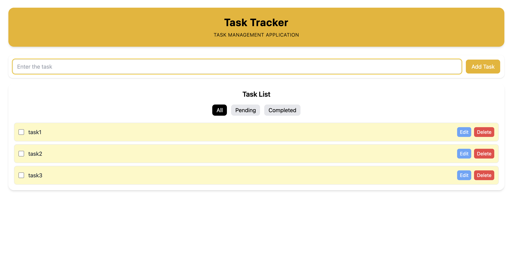
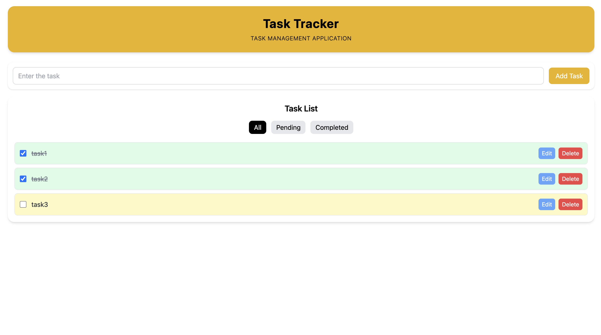
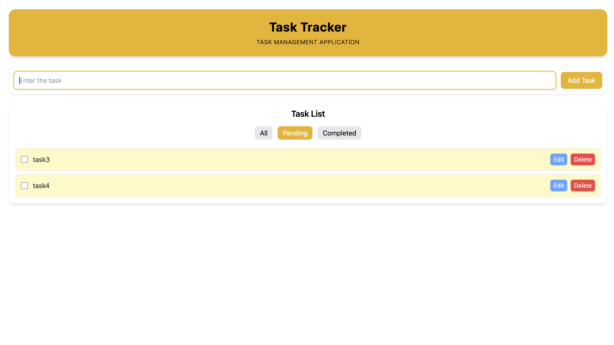
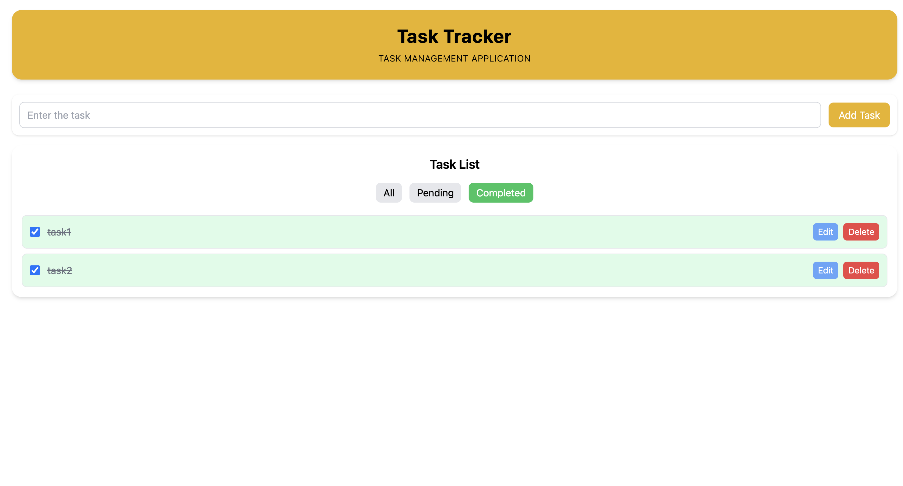
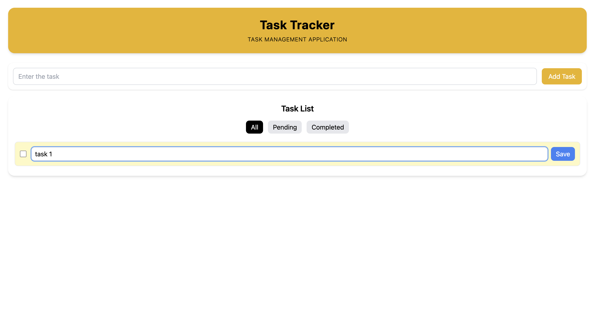

**Task Tracker is an task management application built using ReactJS,t helps users manage daily tasks with ease — add, update, delete tasks with just one click!**

# Features
**Add Tasks:** Users can add new tasks to the list. 
**Edit Tasks:** Users can edit the details of existing tasks. 
**Delete Tasks:** Users can remove tasks from the list. 
**Filter Task:** Users can filter tasks based on completed, pending tasks 

# task-tracker

## complete task

## filter tasks

## edit task
